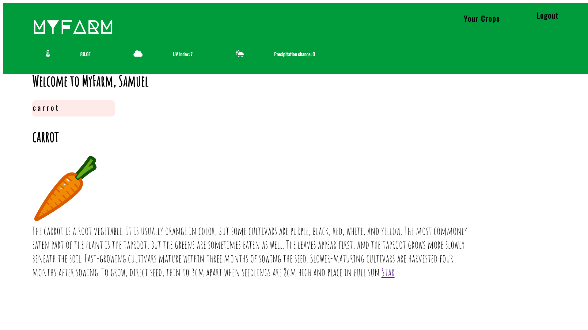

# MyFarm
## How is our country able to produce so much food?

Before technology was invented, farmers worked hours and hours out in the fields.
Now, we have machines; they become more advanced and are able to save farmers time in the fields, which also helps them to have more produce, but according to the Farm Journal Pulse, about 75% of farmers are still working more than 10 hours a day.
Most farmers specialize in certain crops and cultivate based on their instinct.
Through practice and experience, they may be able to find the most suitable conditions for certain crops.
**But is it enough?**
There are so many factors that need to be considered in order to produce the best crops, and farmers are too busy to research their plants thoroughly.
## Introducing MyFarm

MyFarm is a dashboard that supplies farmers with crop details, from lifespan to amount of sunlight needed, and local data such as the weather, in a seamless interface with minimal distraction.
## Why MyFarm?
You might be thinking, aren’t there already apps out there that are aiming at the same goal?
Not quite; specifically, Agrivi and Farm at Hand only allow users to store data, such as their crop stats, and Growstuff and Trefle are APIs that just provide users with data.
However, MyFarm does both. Users can save their favorite crops as well as receive tons of helpful information.
## How do I get it?
MyFarm is out now at myfarmapp.tk! MyFarm Desktop currently supports Windows & Linux (with Mac support in the works), and can be downloaded at desktop.myfarmapp.tk.
# Happy Farming!
